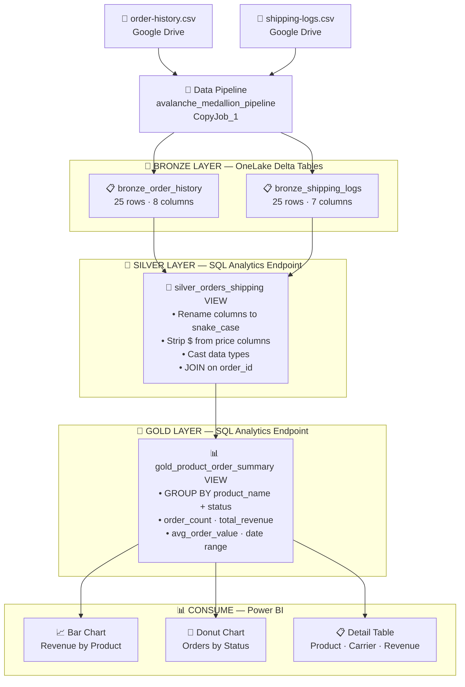
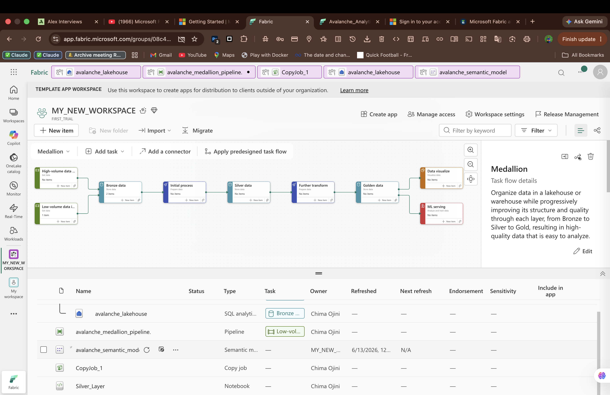
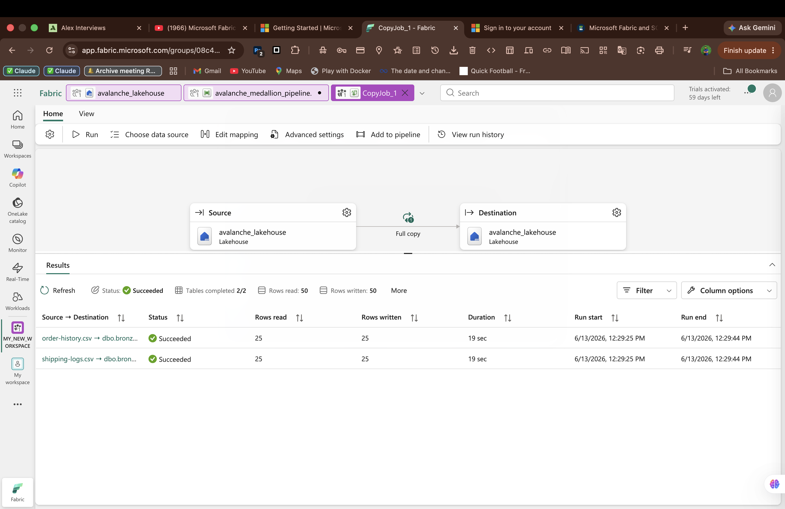
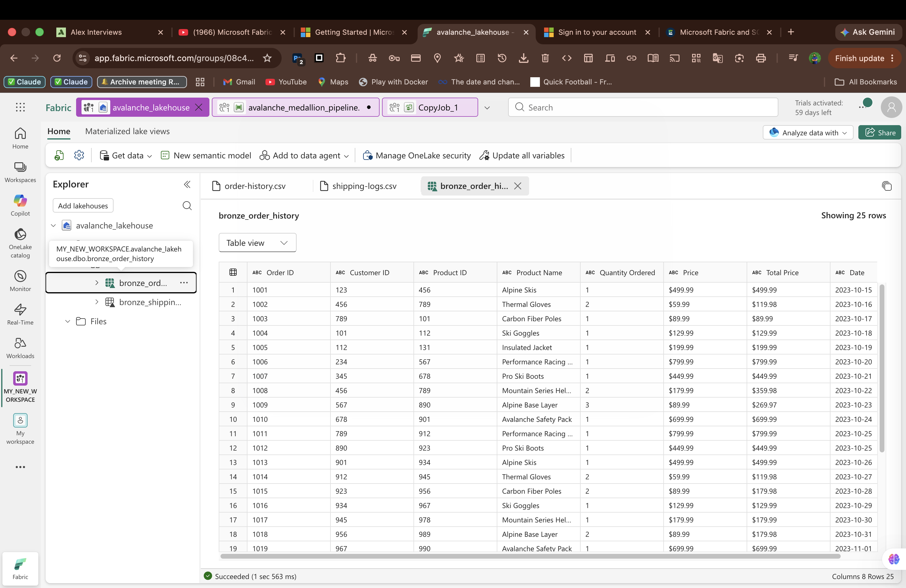
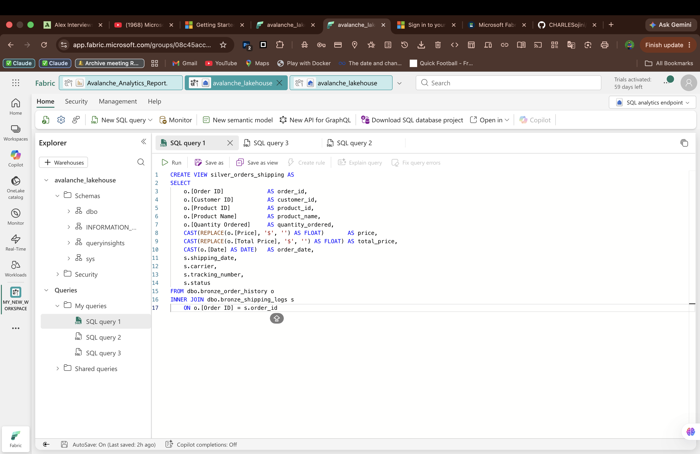
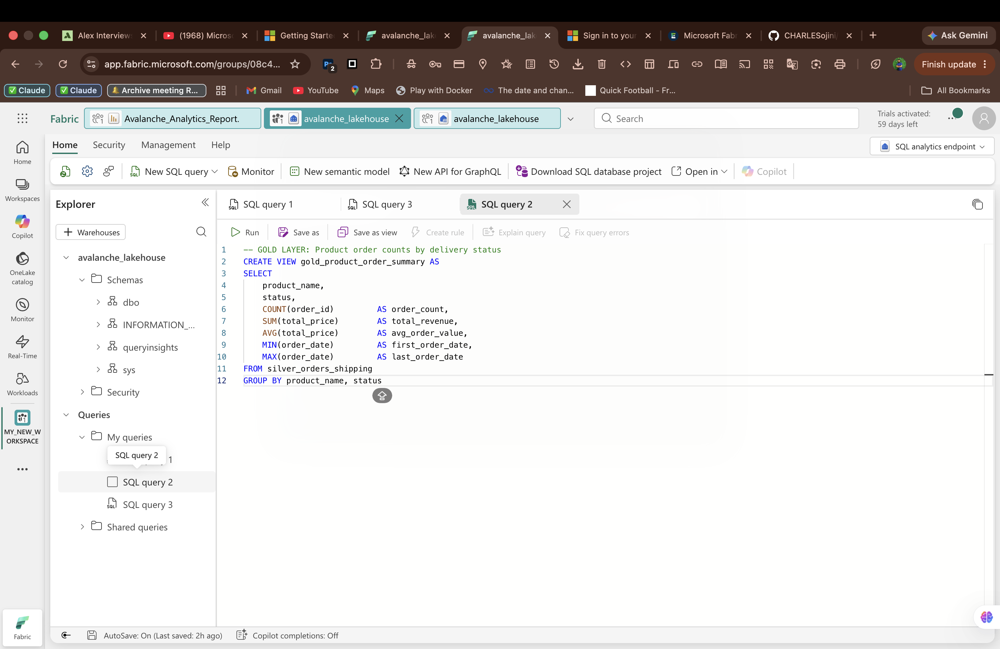
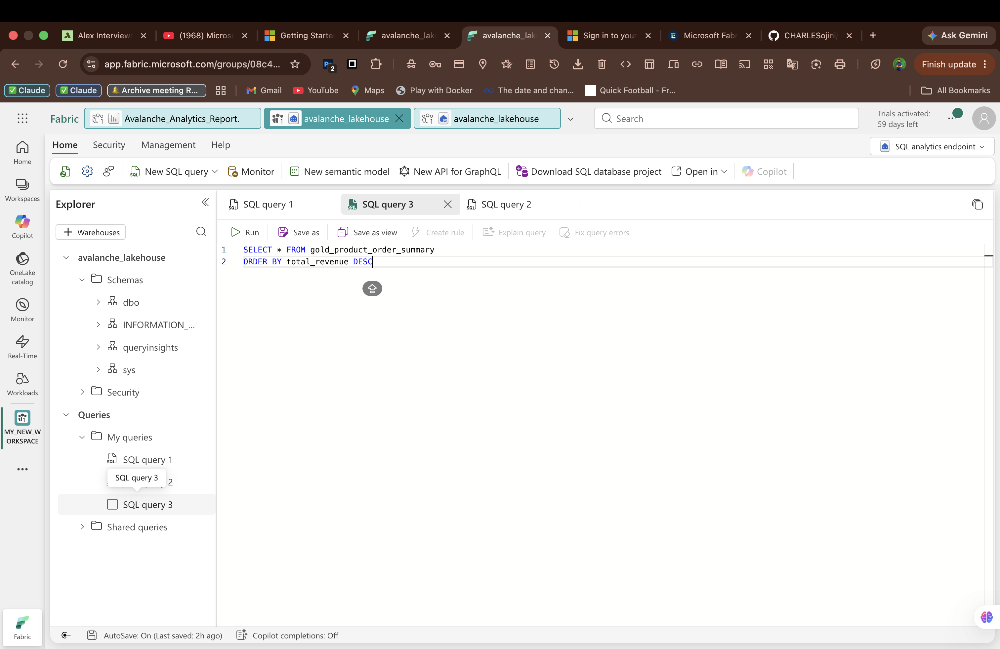
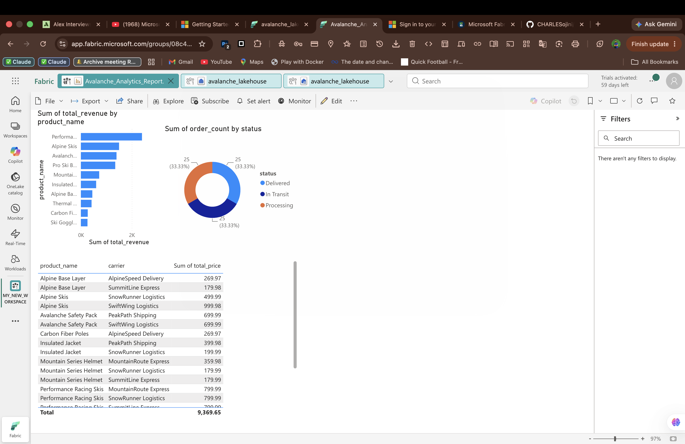

# 🏔️ Avalanche Medallion Pipeline — Microsoft Fabric

> An end-to-end Medallion architecture pipeline built in Microsoft Fabric for Avalanche, a fictional winter sports gear company, analyzing order history and shipping performance.

---

## 📌 Project Overview

Avalanche needed visibility into **product revenue** and **delivery performance** across their order history. This project ingests raw CSV data, transforms it through a Medallion architecture (Bronze → Silver → Gold), and surfaces insights in a Power BI report.

---

## 🏗️ Architecture



---

## 📸 Screenshots

### Workspace Overview


### Bronze Layer — CopyJob Success


### Bronze Layer — Table Preview


### Silver Layer — SQL View


### Gold Layer — SQL View


### Gold Layer — Query Results


### Power BI Report — Avalanche Analytics


---

## 📂 Data Sources

| File | Description | Rows |
|------|-------------|------|
| `order-history.csv` | Customer orders with product, quantity, price | 25 |
| `shipping-logs.csv` | Shipping carrier, tracking, status, coordinates | 25 |

### Source Schema

**order-history.csv**
```
Order ID, Customer ID, Product ID, Product Name, 
Quantity Ordered, Price, Total Price, Date
```

**shipping-logs.csv**
```
order_id, shipping_date, carrier, tracking_number, 
latitude, longitude, status
```

---

## 🔧 Tech Stack

| Layer | Tool |
|-------|------|
| Ingestion | Microsoft Fabric Data Pipeline (Copy Job) |
| Storage | Microsoft Fabric Lakehouse (OneLake) |
| Format | Delta Tables |
| Transformation | SQL Views (SQL Analytics Endpoint) |
| Semantic Model | Microsoft Fabric Direct Lake Semantic Model |
| Visualization | Power BI (Microsoft Fabric) |

---

## 🥈 Silver Layer SQL

```sql
CREATE VIEW silver_orders_shipping AS
SELECT 
    o.[Order ID]              AS order_id,
    o.[Customer ID]           AS customer_id,
    o.[Product ID]            AS product_id,
    o.[Product Name]          AS product_name,
    o.[Quantity Ordered]      AS quantity_ordered,
    CAST(REPLACE(o.[Price], '$', '') AS FLOAT)       AS price,
    CAST(REPLACE(o.[Total Price], '$', '') AS FLOAT) AS total_price,
    CAST(o.[Date] AS DATE)    AS order_date,
    s.shipping_date,
    s.carrier,
    s.tracking_number,
    s.status
FROM dbo.bronze_order_history o
INNER JOIN dbo.bronze_shipping_logs s
    ON o.[Order ID] = s.order_id
```

---

## 🥇 Gold Layer SQL

```sql
CREATE VIEW gold_product_order_summary AS
SELECT 
    product_name,
    status,
    COUNT(order_id)     AS order_count,
    SUM(total_price)    AS total_revenue,
    AVG(total_price)    AS avg_order_value,
    MIN(order_date)     AS first_order_date,
    MAX(order_date)     AS last_order_date
FROM silver_orders_shipping
GROUP BY product_name, status
```

---

## 📊 Key Insights

| Metric | Value |
|--------|-------|
| Total Revenue | $9,369.65 |
| Total Orders | 25 |
| Top Product by Revenue | Performance Racing Skis ($1,599.98) |
| Delivery Status Split | 33.33% Delivered / 33.33% In Transit / 33.33% Processing |
| Carriers Used | AlpineSpeed Delivery, SwiftWing Logistics, PeakPath Shipping, SnowRunner Logistics, SummitLine Express |

---

## 🗂️ Workspace Items

| Item | Type | Purpose |
|------|------|---------|
| avalanche_lakehouse | Lakehouse | OneLake storage for Delta tables |
| avalanche_medallion_pipeline | Pipeline | Bronze ingestion via CopyJob |
| CopyJob_1 | Copy Job | Copies CSVs to Delta tables |
| avalanche_semantic_model | Semantic Model | Direct Lake Power BI model |
| Avalanche_Analytics_Report | Report | Power BI dashboard |

---

## 🚀 How to Reproduce

1. Create a **Lakehouse** in Microsoft Fabric named `avalanche_lakehouse`
2. Upload `order-history.csv` and `shipping-logs.csv` to the **Files** section
3. Create a **Data Pipeline** and use **Copy Data Assistant** to load both CSVs as Delta tables into the Lakehouse
4. Open the **SQL Analytics Endpoint** and create the Silver SQL view
5. Create the Gold SQL view on top of the Silver view
6. Create a **Direct Lake Semantic Model** selecting both views
7. Build a **Power BI Report** from the semantic model

---

## 🔗 Live Project

| Resource | Link |
|----------|------|
| Microsoft Fabric Workspace | [MY_NEW_WORKSPACE — Avalanche Pipeline](https://app.fabric.microsoft.com/groups/08c45acc-d838-4f94-99ff-bc5b59e6bc27/list?experience=fabric-developer&clientSideAuth=0) |
| Portfolio | [charlesojini.github.io/my-portfolio](https://charlesojini.github.io/my-portfolio) |
| GitHub | [github.com/CHARLESojini](https://github.com/CHARLESojini) |

---

## 👨🏾‍💻 Author

**Chima Ojini** — Data Engineer  
📧 Charlesojini32@mail.com  
🌐 [Portfolio](https://charlesojini.github.io/my-portfolio)  
💼 [GitHub](https://github.com/CHARLESojini)
